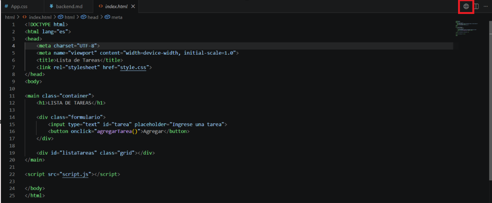
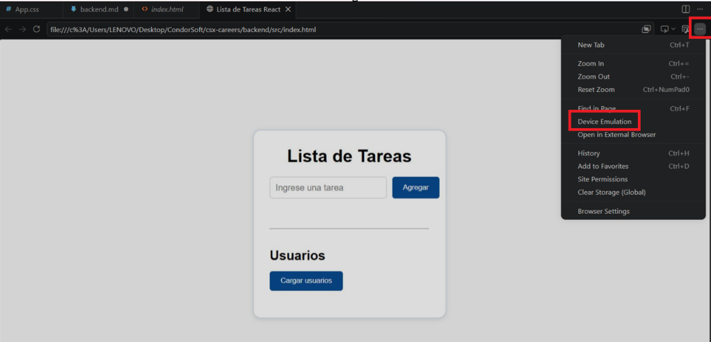
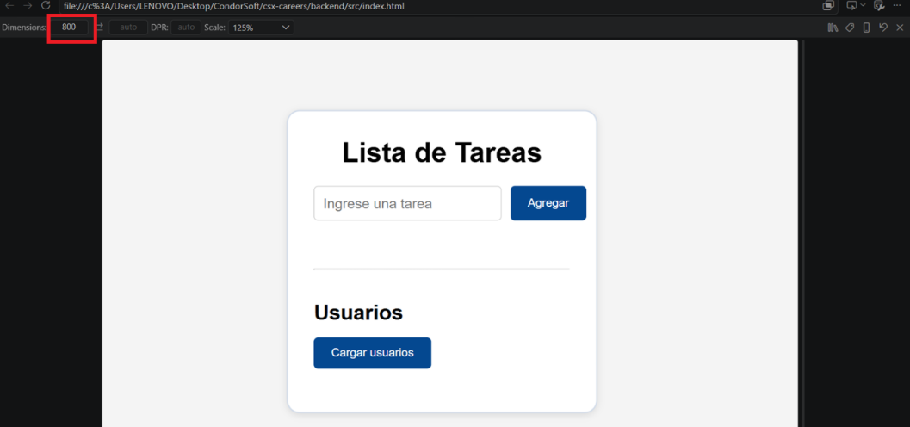

## Instrucciones para ejecutar el proyecto

### Parte HTML, CSS y JavaScript

1. Abrir la carpeta `html`.
2. Ejecutar el archivo `index.html` en un navegador web o en el navegador integrado de Visual Studio Code.

3. Para verificar el diseño responsive, abrir las herramientas de desarrollador con **F12** y activar el modo de dispositivo.

### Parte React

1. Abrir la carpeta `src`.
2. Abrir el archivo `index.html` desde el navegador integrado de Visual Studio Code.

3. Para comprobar el diseño responsive, utilizar el modo de simulación de dispositivos.

4. Ajustar el ancho de la ventana entre **400 px y 700 px**.

